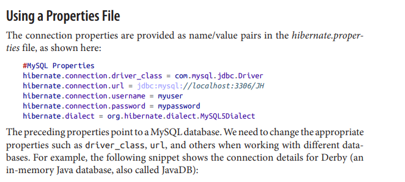
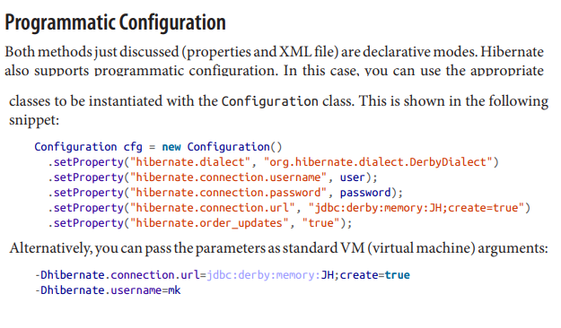

### Hibernate
    

###### 

**Hibernate**  est une solution open source de type **ORM** (Object Relational Mapping) qui permet de faciliter le développement de la couche persistance d'une application. Hibernate permet donc de représenter une base de données en objets Java et vice versa.
C'est l'une des implémentations de mappage **objet-relationnel (ORM) les plus populaires**. Un mappage objet-relationnel définit la relation entre les objets logiciels et les enregistrements de base de données. Bien sûr, Hibernate a des fonctionnalités très larges, mais nous nous concentrerons sur les fonctions les plus simples. 
  
  
    
  
<b> Hibernate Core </b> :
 API native implémentant les services de base pour la persistance

*   Méta-données au format XML (+ annotations depuis la version 3.6)
*   Langage HQL et interface pour écrire des requêtes
 
 
<b>Hibernate Annotations </b>(inclus dans Hibernate Core 3.6) :

*   Remplacement des fichiers XML par des annotations JDK 5.0
*   implémentant les annotations du standard JPA + annotations spécifiques à Hibernate

 
<b> Hibernate Entity Manager :</b> Implémentation de la partie des spécifications JPA concernant

*   Les interfaces de programmation,
*   Les règles de cycle de vie des objets persistants

*   Les fonctionnalités d’interrogation  
Hibernate Entity Manager = wrapper au dessus du noyau Hibernate
implémentant une solution complète de persistance JPA (cf.documentation Hibernate)
   
  
  

### LES PROPRIETE DE CONFIGURATION

!
 
<b>Hibernate a besoin de plusieurs éléments pour fonctionner</b> :

- une classe de type javabean qui encapsule les données d'une occurrence d'une table 
- un fichier de configuration qui assure la correspondance entre la classe et la table (mapping) 
- des propriétés de configuration notamment des informations concernant la connexion à la base de données 

 
 

 
 

 
 
  
 
### Hibernate-mapping

Hibernate a besoin de savoir comment charger et stocker des objets d'une classe persistante. C'est là qu'intervient le fichier de mapping Hibernate. Le fichier de mapping indique à Hibernate à quelle table dans la base de données il doit accéder, et quelles colonnes de cette table il devra utiliser.

- Chargement et stockage des donn´ees persistantes
- Indication des tables et de la BD `a utiliser
- Definition de la structure des tables
- Definition des cl´es primaires
- Correspondance entre les noms et les types des objets et les
noms des colonnes
  
 

  
 
 
 <B>UUID algorithm</B> 
 
Le contenu du UUID est : adresse IP, date de démarrage de la JVM (précis au quart de seconde), l'heure système et un compteur (unique au sein de la JVM). Il n'est pas possible d'obtenir l'adresse MAC ou une adresse mémoire à partir de Java, c'est donc le mieux que l'on puisse faire sans utiliser JNI.

      
  
 
   
 
# Hibernate Version

   
 

  
   
 

  
 
 
